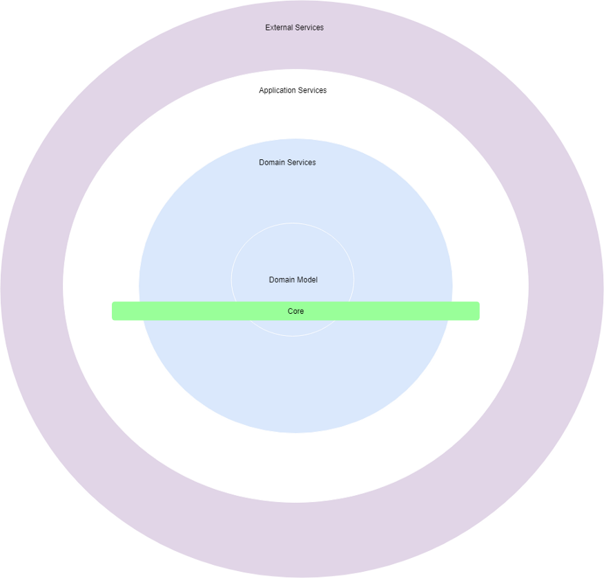

# Onion Architecture
- 아키텍쳐 패턴중의 하나로 유지보수와 점직적인 시스템을 만들 수 있도록 해줌
- 바깥쪽 계층은 안쪽 계층에 의존성을 가지고, 안쪽 계층은 바깥쪽 계층에 의존성을 갖지 않아 좋은 결합도를 가짐
- 이해관계가 분리되어 각 계층은 비슷한 변경을 갖는 개념을 제한함
- 코어 어플리케이션과 인프라 코드를 분리해주어 별도로 실행이 가능하게 해줌
- 어플리케이션은 독립적인 객체 모델로 구성됨
- 안쪽 계층에서 인터페이스를 정의하고 바깥쪽 계층에서 이를 구현함

## Layer

### Domain Model
- Domain Model 계층의 의존성은 자기 자신한테만 종속됨
- 비지니스 entity를 나타냄

### Domain Service
- Domain service 계층은 Model Layer에서 정의된 entity들의 logic을 구현

### Application Service
- Application Service 계층은 외부 infrastructure와 Domain Layer를 연결함