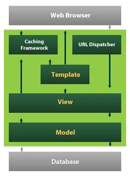
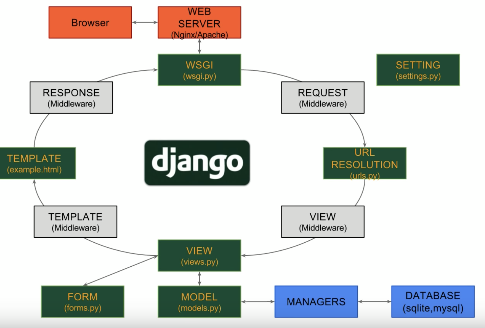

# Django
- Python으로 만들어진 무료 오픈소스 Web Application Framework

## 특징
- ### MVC 패턴 기반 MTV 패턴
    - Django에서는 View를 Template, Controller를 View라고 부름
    - Model
        - 데이터에 관한 정보를 다룸
        - SQLite라는 데이터베이스가 내장되어 있음
    - Template
        - 사용자에게 실제로 보여지는 웹 페이지를 다룸
    - View
        - 특정 데이터가 어떤 상황에서 어떠한 방식으로 처리될지 정의된 함수를 다룸
- ### ORM
    - ORM을 통해 데이터베이스 시스템을 지원
- ### Admin 페이지 제공
    - 데이터베이스에 대한 관리 기능을 제공하는 관리자 페이지를 제공
    - 데이터를 쉽게 생성, 변경할 수 있고 개발자가 별도로 관리 기능을 개발할 필요 없음
- ### 유연한 URL 설계
    - 정규식을 사용하거나 파이썬 함수에 URL을 1대1로 연결할 수 있음
- ### 자체 템플릿 시스템
    - 디자인과 로직에 대한 코딩을 분리하여 독립적으로 개발 가능
- ### 캐시 시스템
    - 동적인 페이지를 만들기 위해서 DB 쿼리를 수행하고 템플릿을 해석하면 관련 로직을 실행해서 페이지를 생헝하는 일은 서버에 많은 부하를 줌
    - 캐시 시스템을 사용하여 자주 이용되는 내용을 저장해 두었다가 재사용하여 부하를 줄여줌
    - 캐시 단위를 사이트 전체, 특정 뷰의 결과, 템플릿의 일부 영역을 지정하여 저장할 수 있음
- ### 다국어 지원
- ### 풍부한 개발환경
- ### 소스코드 변경시 자동 반영

## 구동 방식

1. URL Dispatcher를 통해 유저가 입력한 URL을 분석하여 View에 전달
2. View는 사용자가 요구한 데이터베이스 정보를 Model에게 전달
3. Model은 데이터베이스와 통신하여 데이터를 가져와 View에게 데이터를 전달
4. View는 Template에게 데이터를 전달
5. Template는 UI를 가공해 최종적으로 유저에게 전달할 데이터를 만듬

- ### WSGI(Web Server Gateway Interface)
    - 장고와 웹서버를 연결해주는 역할
    - 웹서버(Nginx)로부터 서버사이드 요청을 받으면 WSGI를 통해 장고로 전달하는 역할을 수행
- ### URL Resolution
    - 정규 표현식으로 구성하고 그에 맞는 특정 View로 전달
- ### View
    - URL을 통해 받은 사용자 request에 따른 데이터의 처리를 결정하고 Model에 신호를 보냄
    - Model에게 받은 정보를 가공
    - 웹페이지나 컨텐츠들은 View를 통해 전달되며 Python의 function으로 나타냄
- ### Model
    - DB에서 데이터를 가져오고 그 데이터를 각각의 클래스에 넣음
- ### Template
    - UI작업이 이루어지는 곳
    - View에서 받은 데이터를 HTML등으로 가공하는 로직이 있음
- ### Form
    - 입력폼(html)생성
    - 입력폼 검증