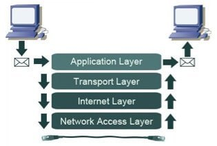

# TCP/IP
## TCP(Transmission Control Protocol)
- 두 호스트가 교환하는 데이터와 승인 메시지의 형식을 정의, 서버와 클라이언트간의 데이터를 신뢰성있게 전달하기 위해 만들어진 통신 규약
- 데이터 패킷에 일련의 번호를 부여함으로써, 데이터의 손실을 찾아서 교정하고 순서를 재조합하여 클라이언트에게 전달
- 신뢰성이 높음

## IP(Internet Protocol)
- 4바이트로 이루어진 주소(e.g 192.169.0.1)
- TCP와 달리 데이터의 재조합이나 손실여부의 확인이 불가능하고, 데이터의 전달만 담당

## TCP/IP란?
- TCP규약과 IP규약을 합친 웹에서 사용하는 통신 규약

- Applicaion Layer
    - HTTP, FTP, Telnet, SMTP 등 네트워크를 사용하는 응용프로그램으로 이루어짐
- Transport Layer
    - TCP, UDP등 시스템을 연결하고 데이터를 전송
- Internet Layer
    - ICMP, IGMP, IP 등 데이터를 정의하고 데이터의 경로를 라우팅
- Network Access Layer
    - Ethernet, ATM 등 네트워크 하드웨어
    - MAC주소 핸들링과 데이터 패킷을 전기신호로 변환하여 선로를 통하여 전송
