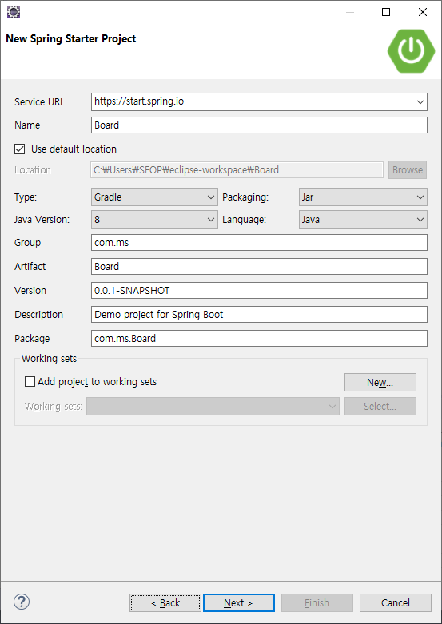
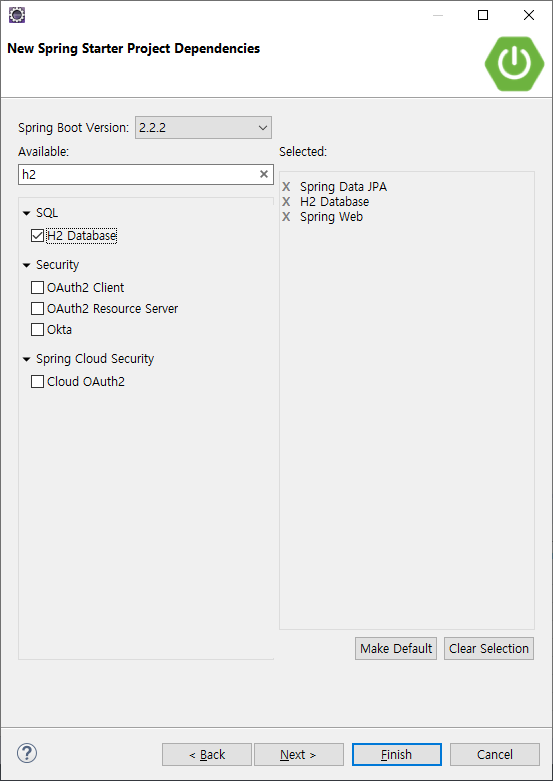
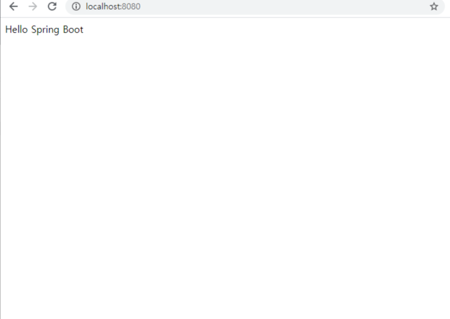
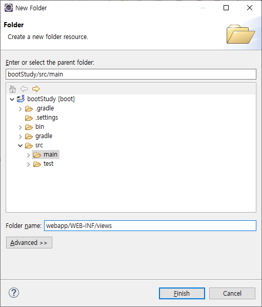
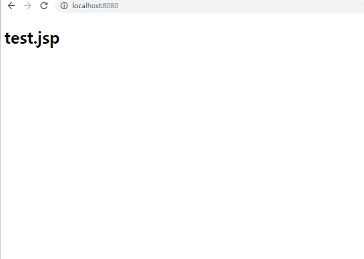
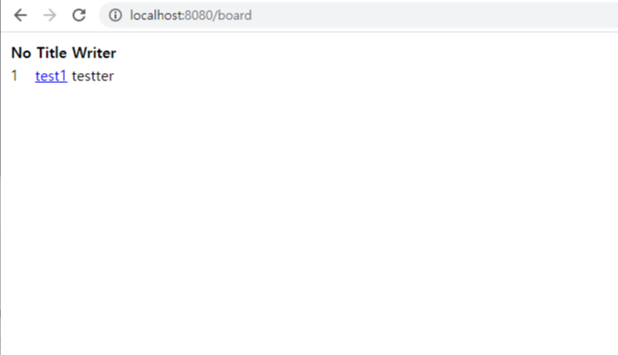

# Spring Boot
-----------
### 개발 환경
- Java : 8
- IDE : Eclipse + STS
- DB : MySql

-----------
## 개발환경 설정

### 1. Eclipse 설치
https://www.eclipse.org/

### 2. 플러그인 설치 (STS, Gradle)
Eclipse Marketplace에서 STS, Gradle 플러그인 설치

### 3. 프로젝트 생성
File -> New -> Spring Starter Project





### 4. 정상 실행 테스트
```Java
package com.ms.study;

import org.springframework.boot.SpringApplication;
import org.springframework.boot.autoconfigure.SpringBootApplication;
import org.springframework.web.bind.annotation.GetMapping;
import org.springframework.web.bind.annotation.RestController;

@RestController
@SpringBootApplication
public class BootStudyApplication {

	public static void main(String[] args) {
		SpringApplication.run(BootStudyApplication.class, args);
	}

	@GetMapping("/")
	public String home() {

		return "Hello Spring Boot";
	}

}
```
Run As -> Spring Boot App (없으면 Java Application)




### 5. JSP view 연동
```Java
// src/main/rescources/application.properties

# MVC View
spring.mvc.view.prefix=/WEB-INF/views/
spring.mvc.view.suffix=.jsp
```
main 디렉토리 밑에 디렉토리 생성



views 폴더에 test.jsp 생성 후

```html
<%@ page language="java" contentType="text/html; charset=EUC-KR"
    pageEncoding="EUC-KR"%>
<!DOCTYPE html>
<html>
<head>
<meta charset="EUC-KR">
<title>Insert title here</title>
</head>
<body>
	<h1>test.jsp</h1>
</body>
</html>
```

views와 연동을 확인하기 위한 컨트롤러 생성
```Java
package com.ms.study;

import org.springframework.stereotype.Controller;
import org.springframework.web.bind.annotation.RequestMapping;

@Controller
public class testController {

	@RequestMapping("/")
	private String index() {
		return "test";
	}
}
```



(404 error가 발생할 경우)
```Java
//build.gradle

plugins {
	id 'org.springframework.boot' version '2.2.2.RELEASE'
	id 'io.spring.dependency-management' version '1.0.8.RELEASE'
	id 'java'
}

group = 'com.ms'
version = '0.0.1-SNAPSHOT'
sourceCompatibility = '1.8'

repositories {
	mavenCentral()
}

dependencies {
	implementation 'org.springframework.boot:spring-boot-starter-data-jpa'
	implementation 'org.springframework.boot:spring-boot-starter-web'
	runtimeOnly 'com.h2database:h2'
	testImplementation('org.springframework.boot:spring-boot-starter-test') {
		exclude group: 'org.junit.vintage', module: 'junit-vintage-engine'
	}
	compile('org.apache.tomcat.embed:tomcat-embed-jasper') //추가
	compile('javax.servlet:jstl:1.2') //추가
}

test {
	useJUnitPlatform()
}
```
----------------
## 기본 로직 + MySQL 연동
### 1. MySQL 연동 설정
```java
//application.properties

# MVC View
spring.mvc.view.prefix=/WEB-INF/views/
spring.mvc.view.suffix=.jsp

#MySQL
spring.datasource.url=jdbc:mysql://localhost:3306/boot_study?serverTimezone=UTC
spring.datasource.username=root
spring.datasource.password=1111
spring.datasource.driver-class-name=com.mysql.cj.jdbc.Driver
spring.jpa.database=mysql
spring.jpa.show-sql=true
```

```java
plugins {
	id 'org.springframework.boot' version '2.2.2.RELEASE'
	id 'io.spring.dependency-management' version '1.0.8.RELEASE'
	id 'java'
}

apply plugin: 'io.spring.dependency-management'

group = 'com.ms'
version = '0.0.1-SNAPSHOT'
sourceCompatibility = '1.8'

repositories {
	mavenCentral()
}

dependencies {
	implementation 'org.springframework.boot:spring-boot-starter-data-jpa'
	implementation 'org.springframework.boot:spring-boot-starter-web'
	runtimeOnly 'com.h2database:h2'
	testImplementation('org.springframework.boot:spring-boot-starter-test') {
		exclude group: 'org.junit.vintage', module: 'junit-vintage-engine'
	}

	//jsp 연동
	compile('org.apache.tomcat.embed:tomcat-embed-jasper')
	compile('javax.servlet:jstl:1.2')

	//mysql
	implementation 'org.hsqldb:hsqldb'
	implementation group: 'org.lazyluke', name: 'log4jdbc-remix', version: '0.2.7'
	runtime('mysql:mysql-connector-java')
}

test {
	useJUnitPlatform()
}
```
설정파일 변경 후 `DB`와 `TABLE` 생성

### 2. domain 클래스 생성
domain 클래스는 Table과 동일한 구조를 갖고 있습니다.
만약 동일한 구조가 아니라면 JPA를 사용하는데 문제가 발생합니다.
```java
package com.ms.study.domain;

import java.time.LocalDateTime;

import javax.persistence.Column;
import javax.persistence.Entity;
import javax.persistence.GeneratedValue;
import javax.persistence.GenerationType;
import javax.persistence.Id;
import javax.persistence.Table;

import com.fasterxml.jackson.annotation.JsonIgnoreProperties;

@Entity //domain 클래스라는 것을 나타냄
@Table(name="board")
@JsonIgnoreProperties({"hibernateLazyInitializer", "handler"}) //Lazy 예외를 방지
public class Board {

	@Id //Primary key 컬럼인 것을 나타냄
	@GeneratedValue(strategy = GenerationType.IDENTITY)
	@Column(name="id")
	private Integer id;

	@Column(name="writer")
	private String writer;

	@Column(name="title")
	private String title;

	@Column(name="content")
	private String content;

	@CreationTimestamp
	@Column(name="created_time")
	private LocalDateTime created_time;

	@UpdateTimestamp
	@Column(name="updated_time")
	private LocalDateTime updated_time;

	public Integer getId() {
		return id;
	}

	public void setId(Integer id) {
		this.id = id;
	}

	public String getWriter() {
		return writer;
	}

	public void setWriter(String writer) {
		this.writer = writer;
	}

	public String getTitle() {
		return title;
	}

	public void setTitle(String title) {
		this.title = title;
	}

	public String getContent() {
		return content;
	}

	public void setContent(String content) {
		this.content = content;
	}

	public LocalDateTime getCreated_time() {
		return created_time;
	}

	public void setCreated_time(LocalDateTime created_time) {
		this.created_time = created_time;
	}

	public LocalDateTime getUpdated_time() {
		return updated_time;
	}

	public void setUpdated_time(LocalDateTime updated_time) {
		this.updated_time = updated_time;
	}
}
```
### 3. Repository 인터페이스 생성
DB와 연동
```java
package com.ms.study.repository;

import org.springframework.data.jpa.repository.JpaRepository;

import com.ms.study.domain.Board;

public interface BoardRepository extends JpaRepository<Board, Integer> {

}
```
### 4. Service 클래스 생성
비지니스 로직을 구현
```java
package com.ms.study.service;

import java.util.List;

import org.springframework.beans.factory.annotation.Autowired;
import org.springframework.stereotype.Service;

import com.ms.study.domain.Board;
import com.ms.study.repository.BoardRepository;

@Service
public class BoardService {

	@Autowired
	BoardRepository boardRepo;

	public List<Board> findAll() {

		List<Board> list = boardRepo.findAll();

		return list;
	}
}
```

### 5. Controller 클래스 생성

클라이언트에게 받은 요청에 대한 응답을 함
```java
package com.ms.study.Controller;

import java.util.List;

import org.springframework.beans.factory.annotation.Autowired;
import org.springframework.stereotype.Controller;
import org.springframework.web.bind.annotation.GetMapping;
import org.springframework.web.servlet.ModelAndView;

import com.ms.study.domain.Board;
import com.ms.study.service.BoardService;

@Controller
public class BoardController {

	@Autowired
	BoardService service;

	@GetMapping("/board")
	public ModelAndView boardList() {

		List<Board> list = service.findAll();
		ModelAndView nextView = new ModelAndView("board/list");
		nextView.addObject("boardList", list);

		return nextView;
	}
}
```

### 6. View 페이지(jsp) 생성
```html
<%@ page language="java" contentType="text/html; charset=EUC-KR"
    pageEncoding="EUC-KR"%>
<%@ taglib prefix="c" uri="http://java.sun.com/jsp/jstl/core"%>
<!DOCTYPE html>
<html>
<head>
<meta charset="EUC-KR">
<title>Insert title here</title>
</head>
<body>
	<table>
		<thead>
			<tr>
				<th>No</th>
				<th>Title</th>
				<th>Writer</th>
			</tr>
		</thead>
		<tbody>
			<c:forEach var="board" items="${boardList }">
				<tr>
					<td>${board.id }</td>
					<td><a href="/board/${board.id }">${board.title }</a></td>
					<td>${board.writer }</td>
				</tr>
			</c:forEach>
		</tbody>
	</table>
</body>
</html>
```



----------
## CRUD

### 1. Create
BoardService.java
```java
package com.ms.study.service;

import java.util.List;

import org.springframework.beans.factory.annotation.Autowired;
import org.springframework.stereotype.Service;

import com.ms.study.domain.Board;
import com.ms.study.repository.BoardRepository;

@Service
public class BoardService {

	@Autowired
	BoardRepository boardRepo;

	public List<Board> findAll() {

		List<Board> list = boardRepo.findAll();

		return list;
	}

	public void create(Board board) {
		boardRepo.save(board);
	}
}
```

BoardController.java
```java
package com.ms.study.Controller;

import java.util.List;

import org.springframework.beans.factory.annotation.Autowired;
import org.springframework.stereotype.Controller;
import org.springframework.web.bind.annotation.GetMapping;
import org.springframework.web.bind.annotation.PostMapping;
import org.springframework.web.servlet.ModelAndView;

import com.ms.study.domain.Board;
import com.ms.study.service.BoardService;

@Controller
public class BoardController {

	@Autowired
	BoardService service;

	@GetMapping("/board")
	public ModelAndView boardList() {

		List<Board> list = service.findAll();
		ModelAndView nextView = new ModelAndView("list");
		nextView.addObject("boardList", list);

		return nextView;
	}

	@GetMapping("/board/create")
	public ModelAndView boardCreate() {

		ModelAndView nextView = new ModelAndView("create");

		return nextView;
	}

	@PostMapping("/board/create")
	public ModelAndView boardCreate(Board board) {
		System.out.println(board);
		service.create(board);
		ModelAndView nextView = new ModelAndView("list");
		List<Board> list = service.findAll();
		nextView.addObject("boardList", list);

		return nextView;
	}
}
```

create.jsp
```html
<%@ page language="java" contentType="text/html; charset=EUC-KR"
    pageEncoding="EUC-KR"%>
<!DOCTYPE html>
<html>
<head>
<meta charset="EUC-KR">
<title>Insert title here</title>
</head>
<body>
	<form action="/board/create" method="POST">
		<label>TITLE</label>
		<input type="text" name="title" /><br>
		<label>WRITER</label>
		<input type="text" name="writer" /><br>
		<label>CONTENT</label>
		<textarea name="content"></textarea><br>
		<button type="submit">CREATE</button>
	</form>
</body>
</html>
```

### 2. Read
BoardService.java
```java
package com.ms.study.service;

import java.util.List;

import org.springframework.beans.factory.annotation.Autowired;
import org.springframework.stereotype.Service;

import com.ms.study.domain.Board;
import com.ms.study.repository.BoardRepository;

@Service
public class BoardService {

	@Autowired
	BoardRepository boardRepo;

	public List<Board> findAll() {

		List<Board> list = boardRepo.findAll();

		return list;
	}

	public void create(Board board) {
		boardRepo.save(board);
	}

	public Board detail(int id) {

		Board detail = boardRepo.getOne(id);

		return detail;
	}
}
```

BoardController.java
```java
package com.ms.study.Controller;

import java.util.List;

import org.springframework.beans.factory.annotation.Autowired;
import org.springframework.stereotype.Controller;
import org.springframework.web.bind.annotation.GetMapping;
import org.springframework.web.bind.annotation.PathVariable;
import org.springframework.web.bind.annotation.PostMapping;
import org.springframework.web.servlet.ModelAndView;

import com.ms.study.domain.Board;
import com.ms.study.service.BoardService;

@Controller
public class BoardController {

	@Autowired
	BoardService service;

	@GetMapping("/board")
	public ModelAndView boardList() {

		List<Board> list = service.findAll();
		ModelAndView nextView = new ModelAndView("list");
		nextView.addObject("boardList", list);

		return nextView;
	}

	@GetMapping("/board/create")
	public ModelAndView boardCreate() {

		ModelAndView nextView = new ModelAndView("create");

		return nextView;
	}

	@PostMapping("/board/create")
	public ModelAndView boardCreate(Board board) {

		service.create(board);
		ModelAndView nextView = new ModelAndView("list");
		List<Board> list = service.findAll();
		nextView.addObject("boardList", list);

		return nextView;
	}

	@GetMapping("/board/{id}")
	public ModelAndView detail(@PathVariable("id") int id) {

		ModelAndView nextView = new ModelAndView("detail");
		Board detail = service.detail(id);
		nextView.addObject("detail", detail);

		return nextView;
	}
}
```

detail.jsp
```html
<%@ page language="java" contentType="text/html; charset=EUC-KR"
    pageEncoding="EUC-KR"%>
<%@ taglib prefix="c" uri="http://java.sun.com/jsp/jstl/core"%>
<!DOCTYPE html>
<html>
<head>
<meta charset="EUC-KR">
<title>Insert title here</title>
</head>
<body>
	<table>
		<thead>
			<tr>
				<th>No</th>
				<th>Title</th>
				<th>Writer</th>
				<th>Content</th>
			</tr>
		</thead>
		<tbody>
			<tr>
				<td>${detail.id }</td>
				<td>${detail.title }</td>
				<td>${detail.writer }</td>
				<td>${detail.content }</td>
			</tr>
		</tbody>
	</table>
</body>
</html>
```
