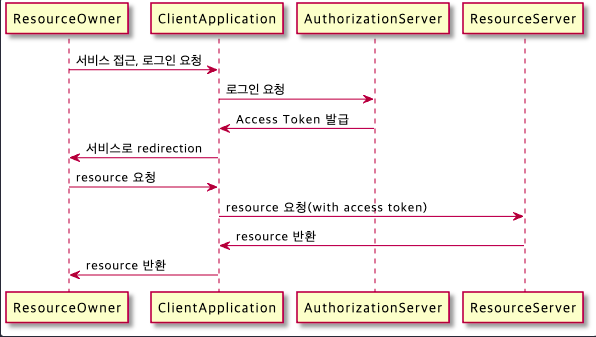

# OAuth 2.0
- `Open Authorization, Open Authentication2`의 약어로 인증을 위한 표준 프로토콜
- 인증을 위한 프로토콜
- 인증(Authentication)과 인가(Authorization)을 모두 포함한 개념으로 인가에 초점을 맞추고 있음  
- 구글, 페이스북, 카카오 등에서 제공하는 `Authorization Server`를 통해 회원 정보를 인증하고 `Access Token`을 발급
- 발급 받은 `Access Token`을 이용해 다른 서비스의 API를 이용할 수 있음
- 다른 서비스의 회원 정보를 안전하게 사용하기 위한 방법

## 개념
-----------
1. ### Authentication
  - 인증, 접근 자격이 있는지 검증
2. ### Authorization
  - 인가, 리소스에 접근할 수 있는 자격을 부여(Access Token을 발급)
3. ### Access Token
  - 리소스 서버에서 리소스를 가져올 수 있는 권한이 부여된 토큰
  - 만료 시간이 존재
4. ### Refresh Token
  - Access Token 만료 시간을 갱신하기 위한 토큰

## 역할
------------
1. ### Resource Owner
  - 사용자로 사람 또는 어플리케이션이 될 수 있음
2. ### Client Application
  - 사용자가 사용하는 서비스 어플리케이션
3. ### Authorization Server
  - OAuth를 통해 인증, 인가를 처리
  - 권한을 부여한 Access Token 발급
4. ### Resource Server
  - 사용자의 리소스를 제공하는 서버

## 인증 과정


<!-- ```plantuml
@startuml
  ResourceOwner -> ClientApplication : 서비스 접근, 로그인 요청
  ClientApplication -> AuthorizationServer : 로그인 요청
  AuthorizationServer -> ClientApplication : Access Token 발급
  ClientApplication -> ResourceOwner : 서비스로 redirection
  ResourceOwner -> ClientApplication : resource 요청
  ClientApplication -> ResourceServer : resource 요청(with access token)
  ResourceServer -> ClientApplication : resource 반환
  ClientApplication -> ResourceOwner : resource 반환
@enduml
``` -->
