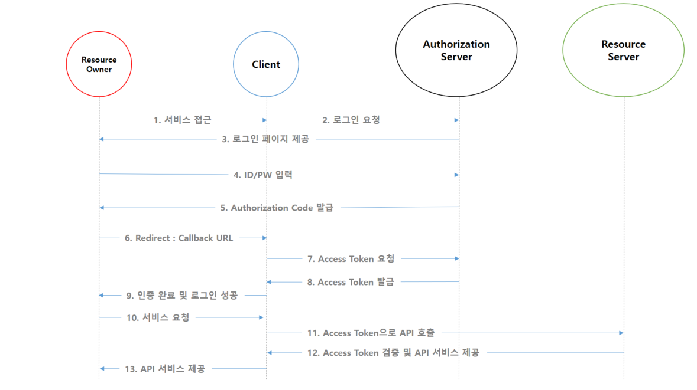

# OAuth 2.0
- `Open Authorization, Open Authentication2`의 약어로 인증을 위한 표준 프로토콜
- 구글, 페이스북, 카카오 등에서 제공하는 `Authorization Server`를 통해 회원 정보를 인증하고 `Access Token`을 발급
- 발급 받은 `Access Token`을 이용해 다른 서비스의 API를 이용할 수 있음
- 다른 서비스의 회원 정보를 안전하게 사용하기 위한 방법

## 개념
- ### Resource Owner
    - `Resource Server`(e.g. 구글, 페이스북, 카카오)의 계정을 소유하고 있는 사용자
- ### Client
    - 구글, 페이스북, 카카오 등의 API 서비스를 이용하는 제 3의 서비스
- ### Authorization Server
    - 권한을 관리해주는 서버
    - `Access Token`, `Refresh Token`을 발급, 재발급 해주는 역할
- ### Resource Server
    - `OAuth2` 서비스를 제공하고 자원을 관리하는 서버
- ### Access Token
    - `Authorization Server`로 부터 발급 받은 인증 토큰
    - `Resource Server`에 전달하여 서비스를 제공 받을 수 있음

## 인증 과정
