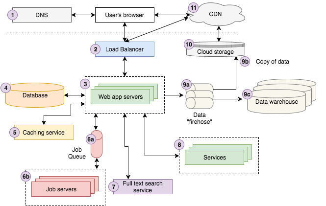

# Web-Architecture
--------------

## 1. DNS
- `Domian Name Server`의 약자로 `월드 와이드 웹(WWW)`이 가능하도록 만드는 기반 기술
- 가장 기본적인 레벨의 `DNS`는 `도메인 이름`(ex. google.com)에서 `IP주소`로의 키/값 조회를 제공

## 2. Load Balancer
- `수평적 확장`을 가능하게해줌
- 들어오는 요청을 복제/미러링 된 수많은 애플리케이션 서버 중의 하나로 연결하고 서버의 응답을 클라이언트로 보냄
- 모든 서버는 특정 요청을 같은 방식으로 처리해야 하며 `로드 밸런서`는 이들 서버에 과부하가 거리지 않도록 들어오는 요청을 적절히 분배해줌

## 3. Web App Server
- 고수준의 웹 애플리케이션 서버는 사용자의 요청이 들어오면 비지니스 로직을 실행하고 그 결과를 HTML에 담에 브라우저에 응답
- 이 일을 하기 위해서는 DB, 캐싱 계층, 잡 큐, 검색 서비스, 기타 마이크로 서비스, 데이터/로그 큐 등 다양한 백엔드 인프라와 데이터를 주고받아야함

## 4. DB Server
- 모든 모던 웹 애플리케이션은 정보를 저장히기 위해 한 개 이상의 `DB`를 사용
- `DB`는 데이터 구조를 정의, 데이터 삽입, 데이터 검색, 데이터 수정, 데이터 삭제, 데이터 연산 등의 일을함
- 웹 애플리케이션 서버는 잡 서버의 역할을 하는 `DB 서버`와 직접 통신
- 백엔드 서비스는 애플리케이션의 다른 영역과 분리된 자신만의 DB를 가지고 있을 수 있음

## 5. Caching Service
- 캐싱 서비스는 정보를 거의 `O(1)`시간 안에 찾을 수 있는 단순한 키/값 데이터 저장소를 제공
- 애플리케이션은 캐싱 서비스를 통해 자원이 많이 소모되는 연산의 결과를 다시 계산하지 않고 캐시에서 가져옴으로써 효율을 높임
- 애플리케이션은 DB의 쿼리 결과, 외부 서비스 호출 결과, 주어진 URL의 HTML 등을 캐시에 저장

## 6. Job Queue & Job Server
- 거의 모든 웹 애플리케이션은 사용자의 요청에 대한 응답과는 직접적인 관련이 없는 작업을 백그라운드에서 비동기적으로 실행할 필요가 있음(ex. 구글의 검색 결과를 얻기 위해 인터넷에서 데이터를 크롤링하고 인덱싱)
- 이러한 비동기적인 작업을 하기위한 `Job Queue`아키텍쳐는 잡으로 이루어진 `큐`와 `큐`에 들어있는 `잡`을 실행하는 1개 이상의 `잡 서버`로 구성됨
- `잡 큐`는 비동기적으로 실행될 잡 목록을 저장하고 있음
- `우선 순위가 적용된 큐`가 필요하지만 가장 단순한 것은 `FIFO 큐`
- `잡 서버`는 잡 큐를 가져와서 할일이 있는지 확인하고 있다면 큐에서 잡을 뽑아내서 실행

## 7. Full Text Search Service
